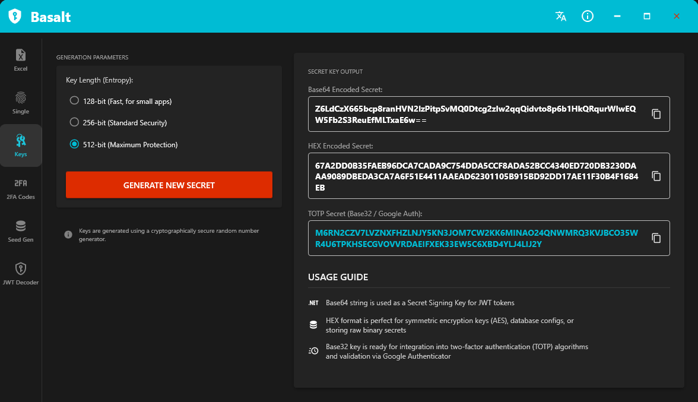
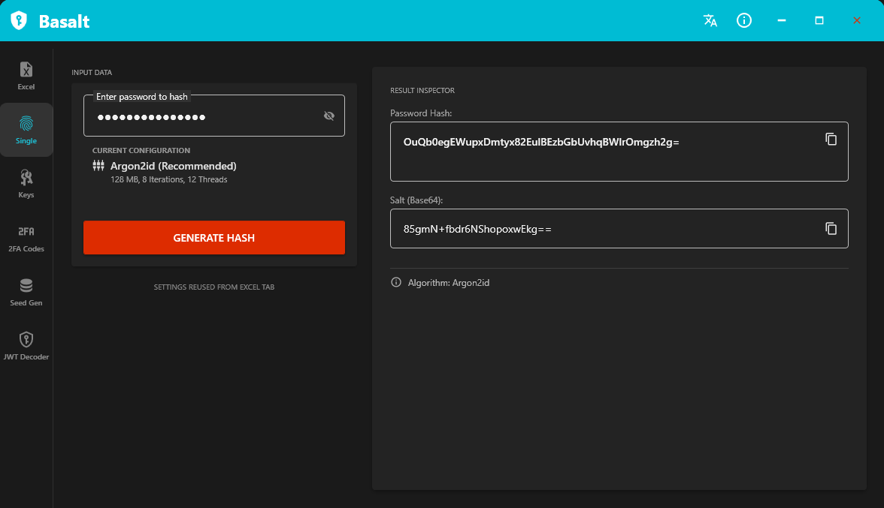
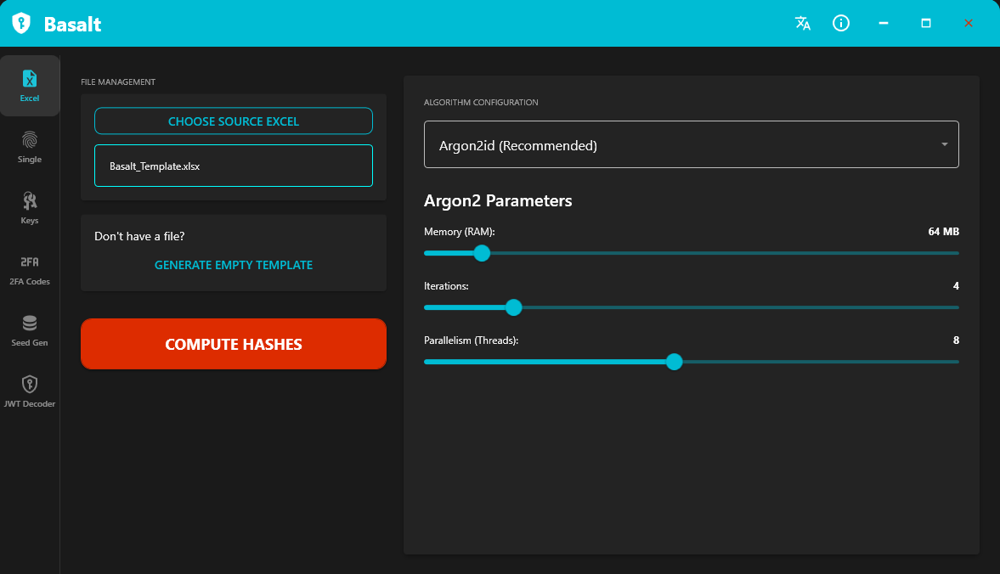
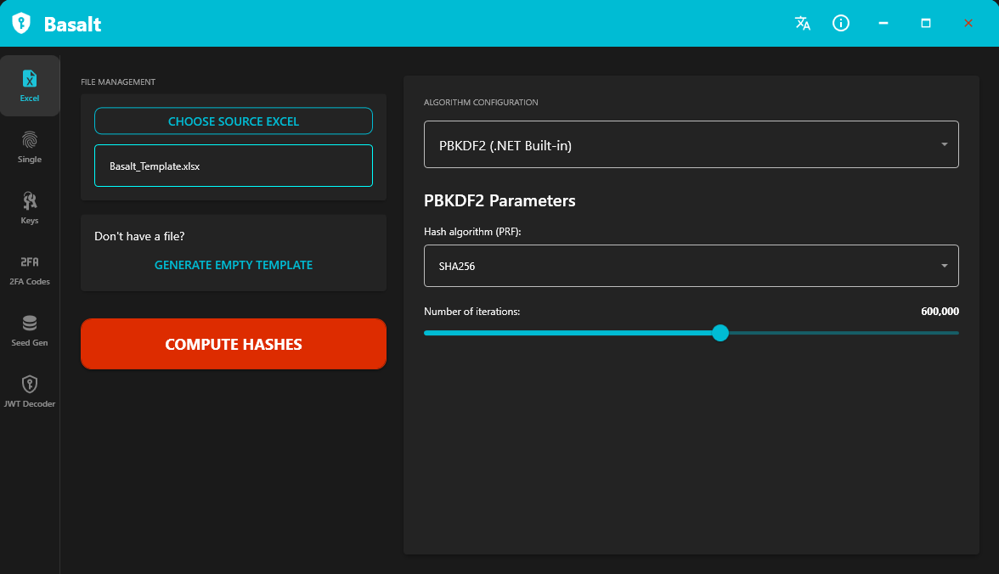
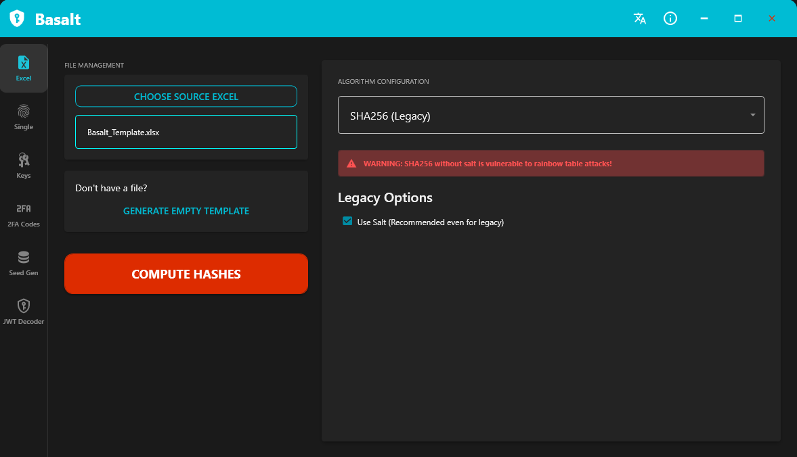
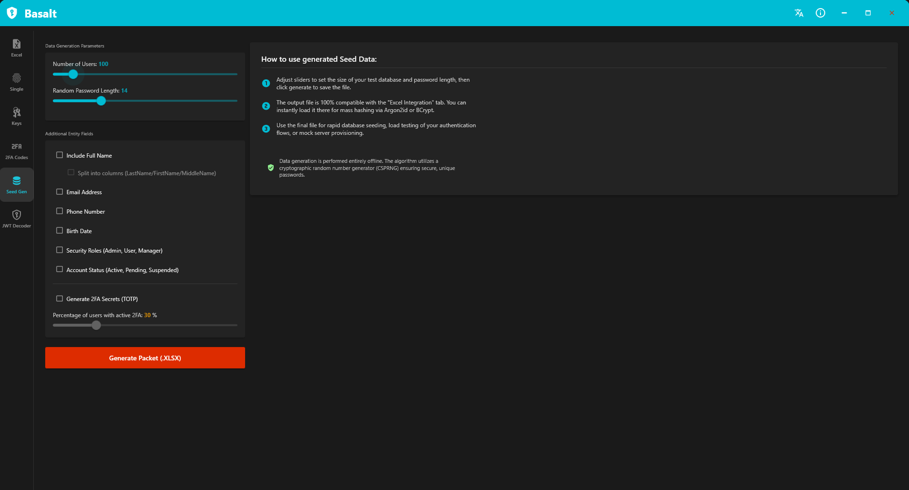
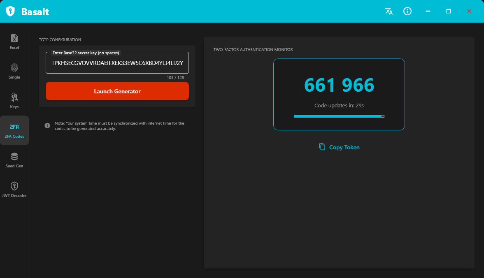
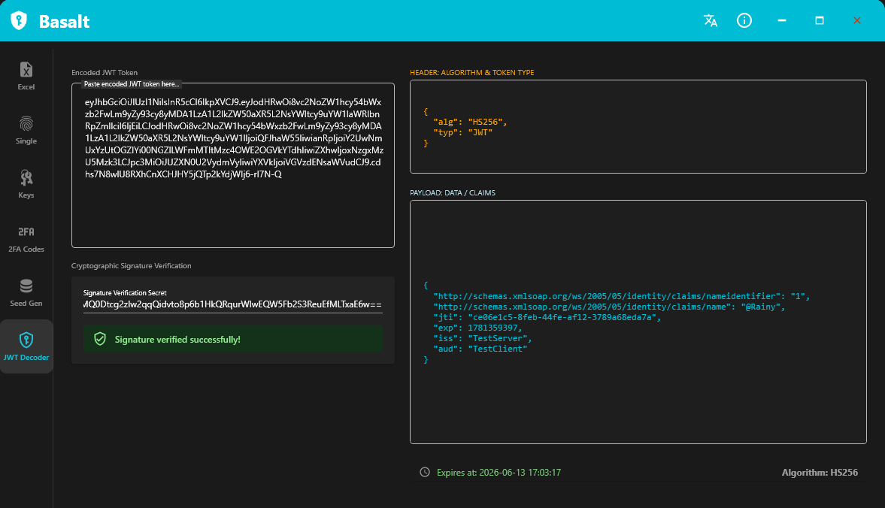

# Basalt 🛡️

**Basalt** is a specialized, production-ready desktop tool for developers and security professionals designed for generating reliable cryptographic resources, analyzing secure tokens, and testing authentication mechanisms. Operating completely offline under a strict zero-knowledge architecture, it focuses on providing an intuitive yet powerful interface for complex cryptographic operations.

---

## Technical Interface & Features

### 🔑 Key Generation
Generates high-entropy cryptographically secure pseudo-random secrets with targeted bit depths (128, 256, or 512 bits). Outputs are automatically encoded into multiple standard formats concurrently alongside context-aware integration guides.

  
📸 View Key Generation Module Interface

  

* **Multi-Format Encoding:** Provides instantaneous output for Base64 strings, raw HEX streams, and stripped Base32 formats.
* **Adaptive Guidance:** Displays direct documentation mappings detailing precise use-cases (e.g., JWT Signing Keys, AES symmetric keys, or TOTP registration strings) depending on the selected length.

---

### 🧮 Password Engineering (Single Hash)
Allows real-time evaluation and configuration of single-credential hashing models leveraging underlying parameters pulled directly from the batch-processing engine.

  
📸 View Single Hash Module Interface

  

* **State Inheritance:** Inherits runtime parameters seamlessly from the primary Excel configuration view to prevent administrative workflow disconnects.
* **Isolated Output Inspectors:** Separates the finalized password string hash from its unique Base64 cryptographically secure initialization vector (Salt) for deep inspecting.

---

### 📊 Batch Processing & Excel Integration
Designed for enterprise migration, database population, and bulk account audits. Supports flexible, multi-threaded calculations across four core algorithmic strategies.

  
⚙️ View Argon2id Parameter Configuration

  

  
⚙️ View BCrypt Parameter Configuration

  

  
⚙️ View PBKDF2 Parameter Configuration

  

  
⚙️ View Legacy SHA256 Configuration & Warnings

  

* **Template Automation:** Features an integrated spreadsheet schema generator (`ClosedXML`) creating clean, structured target fields ensuring data parsing compatibility.
* **Granular Hardware Sliders:** Direct tuning bounds over intense memory footprints (RAM allocation limits), compute iteration passes, and parallel thread limits matching specialized hardware environments.
* **Cryptographic Safeguards:** Includes contextual alerts and proactive mitigation systems (e.g., automatic warning banners when attempting un-salted legacy SHA256 computations).

---

### 🌱 Database Seed Generator
Generates mock user environments to facilitate deterministic database seeding without the processing inefficiencies or data overlap characteristic of simple randomized loops.

  
📸 View Database Seed Generator Interface

  

* **Entity Customization:** Supports optional targeted parameters including full names, structural breakdown splits (Last/First/Middle formatting blocks), randomized matching passwords, emails, secure telephone links, security access levels, and active system operational states.
* **Proportional 2FA Secret Seeding:** Employs a zero-waste target distribution engine assigning Base32 secrets across exact user-specified sample percentages, optimizing database population on smaller unit testing pools.

---

### ⏱️ 2FA Codes (TOTP Monitor)
A diagnostic utility verifying the validity, time-drift synchronization, and parsing accurate token generation for time-based one-time authorization tokens.

  
📸 View 2FA Monitor Interface

  

* **Active Lifetime Tracker:** Features a precision 30-second countdown system tied to a clean UI progress visual overlay reflecting transient authentication valid ranges.
* **Robust Key Normalization:** Cleans formatting variances during manual key entry to seamlessly parse raw authorization structures.

---

### 🔍 JWT Decoder / Inspector
A diagnostic view built for real-time decoding, structural dissection, and signature confirmation of JSON Web Tokens without relying on online validation tools.

  
📸 View JWT Decoder Interface

  

* **Formatted Syntax Highlighting:** Decodes composite base64 strings into readable structured formats parsing structural components (Header information vs Claim payloads).
* **Fixed-Time Verification:** Protects verification mechanisms from side-channel timing analysis vectors during HMAC validation sweeps (`HS256`, `HS384`, `HS512`).
* **Temporal Normalization:** Instantly translates implicit Unix timestamps (`exp` claims) into system local time values while rendering persistent operational indicators.

---

## Tech Stack & Architecture

- **Language:** C#
- **Platform:** .NET 10 / Windows Presentation Foundation (WPF)
- **UI Design:** Material Design in XAML (v5.0+ Base Theme Layer)

### Core Dependencies (NuGet)
* `MaterialDesignThemes` — Modern component rendering & styling suite
* `Konscious.Security.Cryptography.Argon2` — Argon2id implementation
* `BCrypt.Net-Next` — Enhanced BCrypt core wrapper
* `Otp.NET` — Standard-compliant RFC TOTP calculation engine
* `ClosedXML` — Strict open XML spreadsheet creation logic
* `System.Security.Cryptography` — Native cryptographic abstractions

---

## License

This project is licensed under the MIT License.